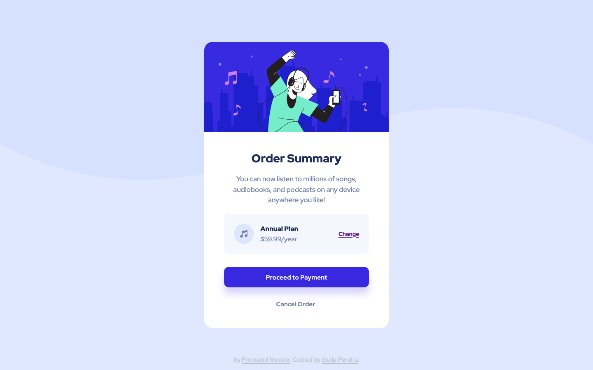

# Frontend Mentor - Order summary card solution

This is a solution to the [Order summary card challenge on Frontend Mentor](https://www.frontendmentor.io/challenges/order-summary-component-QlPmajDUj). Frontend Mentor challenges help you improve your coding skills by building realistic projects. 

-------

## Table of contents

- [Overview](#overview)
  - [The challenge](#the-challenge)
  - [Screenshot Solution](#screenshot-solution)
  - [Links](#links)
- [My process](#my-process)
  - [Built with](#built-with)
  - [What I learned](#what-i-learned)
- [Author](#author)

-------

## Overview

  ### **The challenge**

  Users should be able to:

  - See hover states for interactive elements

### Screenshot Solution

| Desktop | Mobile |
|---|---|
|||

-------

### Links

- Live project on [GitHub](https://guilepereira.github.io/order-summary/)

- Solution on [Order Summary by Guile Pereira](https://www.frontendmentor.io/solutions/order-summary-card-solution-bem-and-atomic-design-9btK0dq0Ge)

## My process

In this project I tried to improve my coding process based on the perceptions and feedbacks I had in previous projects, so my focus was to refine my accuracy in achieving the proposed design.

### Built with

- Semantic HTML5 markup;
- CSS custom properties;
- Flexbox;
- Accessibility;
- Methodology BEM (Block Element Modifier);
- Atomic Design.

### What I learned

In this project, I started to improve my perception of relative measures, which I intend to improve in my next project, by applying the proportion of 62.5% to the font size. As for the BEM methodology, I could understand the use of "mixes" which solved some conflicts I had in previous projects.

## Author

- LinkedIn - [Guile Pereira](https://www.linkedin.com/in/guilevpereira/)
- GitHub - [Guile Pereira](https://github.com/guilepereira)
- Frontend Mentor - [@guilepereira](https://www.frontendmentor.io/profile/guilepereira)
